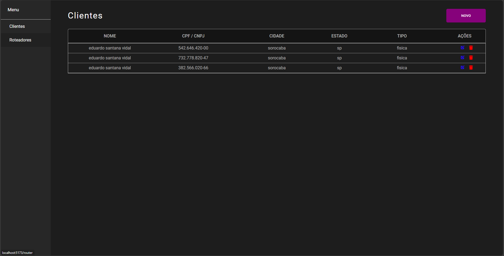
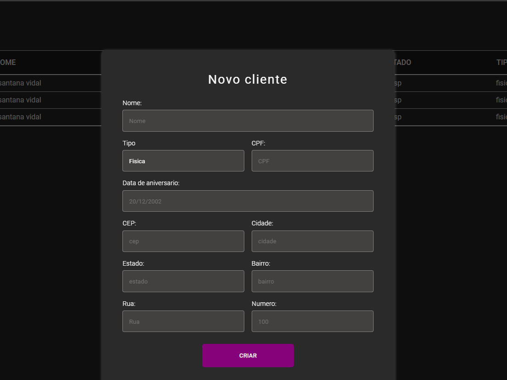
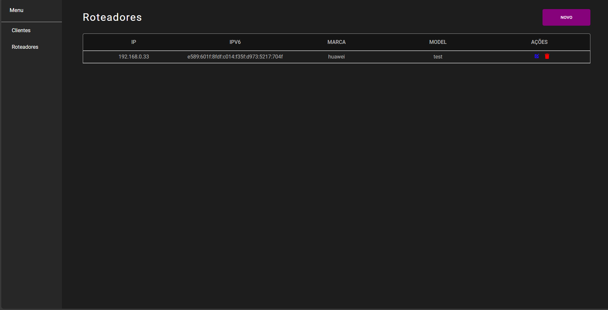
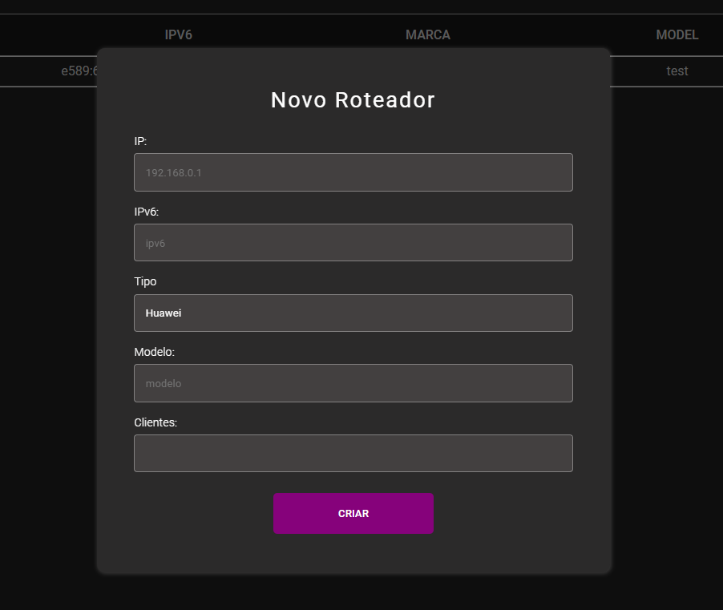
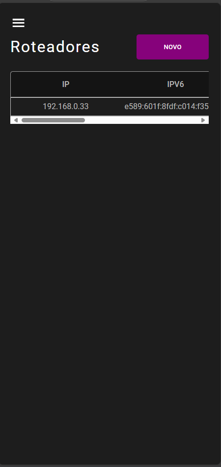

# Frontend

## Organização de pastas
* @types: A pasta @types é onde estão localizados os nossos tipos globais.
* pages: A pasta pages é onde estão localizadas as páginas disponíveis no sistema e também seus subcomponentes.
* services: A pasta services é onde estão localizadas as funções que acessam sistemas externos como a nossa aplicação backend.
* shared: A pasta shared é onde estão localizados os componentes, constantes, utilitarios, estilos, e hooks que podem ser reutilizados em diversas partes da aplicação.

## Telas










## Como executar o projeto?

Primeiramente será necessário alterar a VITE_BASE_URL que está localizada no arquivo .env.

```env 
VITE_BASE_URL="http://localhost:8080"
```
Após isto, é só executar os seguintes comandos no terminal: 

```.sh
  npm install
  npm run dev
```

## Tecnologias utilizadas
* ReactJs
* Typescript
* Styled-components
* Axios
* React-icons
* Zod
